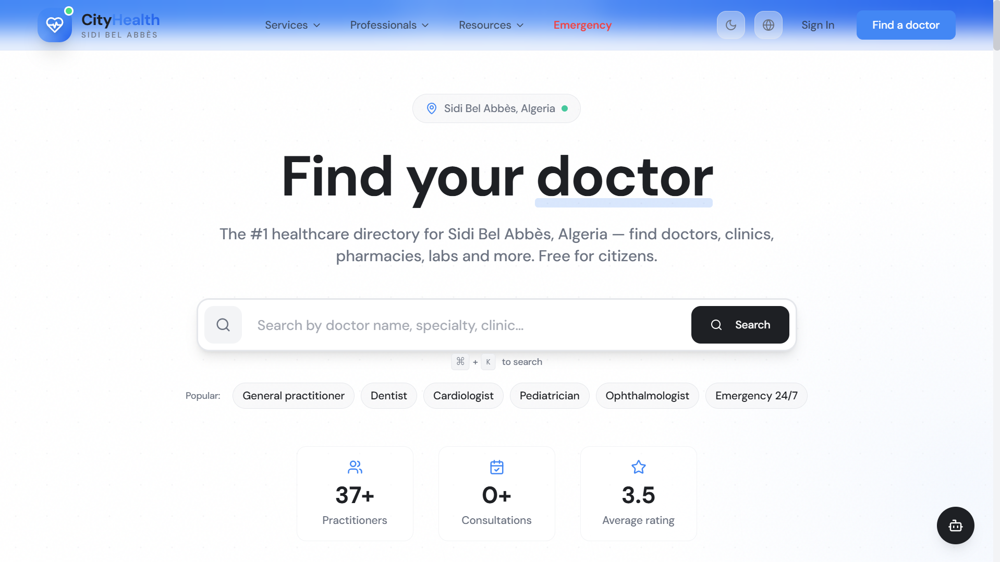
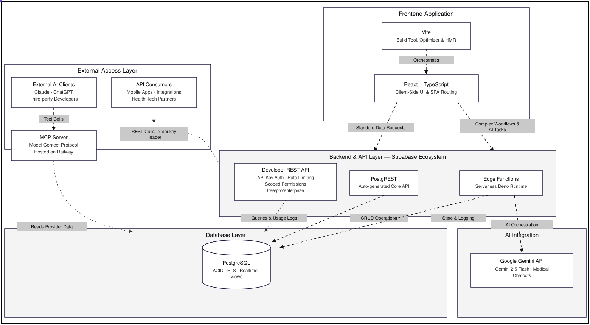
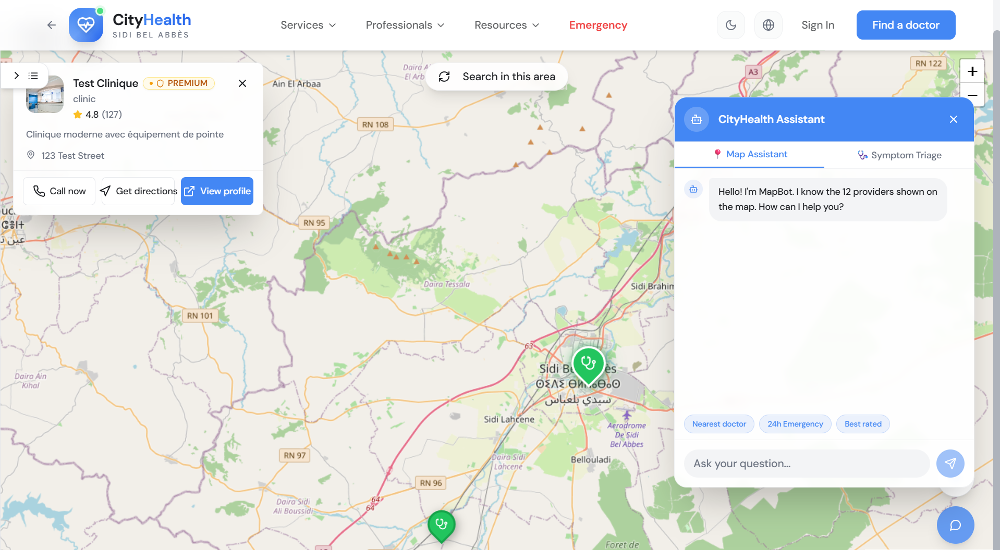
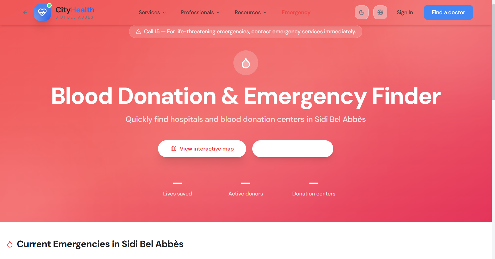
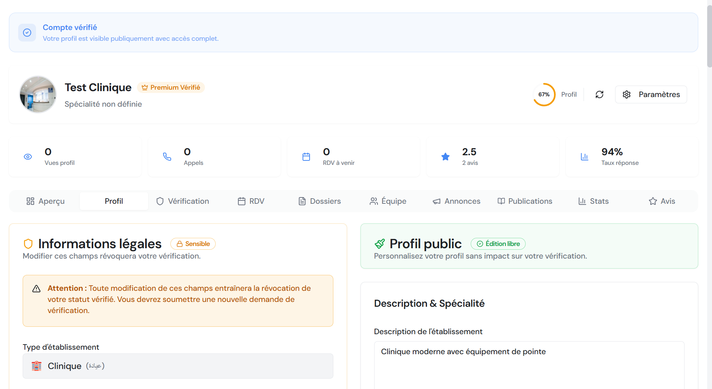
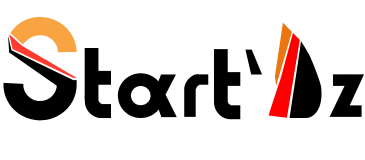

<div align="center">


# CityHealth

**Algeria's verified healthcare infrastructure, accessible everywhere.**

[](https://cityhealthdz.com)
[](https://mcp.cityhealthdz.com/mcp)
[](https://cityhealthdz.com/api/docs)
[](./docs/thesis-report.pdf)

*Solo full-stack. 12 months. 5 deployed platforms.*

</div>

---

<h2 align="center">The Problem</h2>

Healthcare data in Algeria is fragmented, unverified, and almost entirely offline. When someone needs a specialist at night, they call friends, scroll through Facebook posts from months ago, or drive to three pharmacies hoping one is still open. There is no authoritative directory. There is no verified source.

That gap is what this project addresses.

---

<h2 align="center">What I Built</h2>

CityHealth is a **unified monorepo** — one strictly verified PostgreSQL database feeding five separate, production-deployed platforms. Every provider in the system has passed through an automated OCR validation pipeline before appearing in any search result.

<div align="center">
  
</div>

<br/>

| Platform | What it does | Status |
|:---|:---|:---:|
| [**Web Platform**](./web-platform) | GPS-aware search for doctors, clinics, pharmacies — with an admin verification dashboard and blood donation hub | ✅ Live |
| [**Mobile Application**](./mobile-application) | React Native app with offline map caching, emergency routing, and Gemini-powered triage | ✅ Live |
| [**REST API**](./rest-api) | Tiered developer API (SHA-256 auth, rate limiting, PostGIS endpoints, Swagger docs) | ✅ Live |
| [**AI MCP Server**](./ai-mcp-server) | Model Context Protocol server — Claude and ChatGPT can natively query Algeria's health directory | ✅ Live |
| [**Browser Extension**](./browser-extension) | Manifest V3 Chrome/Firefox extension that pushes blood donation alerts to matched donors in real time | ✅ Live |

---

<h2 align="center">Architecture</h2>

The entire system is built around a single principle: **one source of truth, no exceptions.**


<div align="center">
  
</div>

**Key decisions that shaped the stack:**

- **PostgreSQL over Firebase** — Healthcare data is relational. PostGIS handles proximity queries in a single SQL call. Row-Level Security enforces access control at the database layer, not the application layer.
- **Railway over Vercel for the MCP server** — Vercel serverless functions cap SSE connections at ~25 seconds. The MCP protocol needs a persistent process. Running a Dockerized Node service on Railway solved this cleanly.
- **PostgREST for the developer API** — The schema compiles directly into REST endpoints. No hand-written CRUD, no drift between documentation and behaviour.
- **Tesseract.js for OCR on the client** — Provider credentials stay on the user's machine during extraction. No data leaves to a third-party OCR service. Arabic and French script support is handled locally.
- **Manifest V3 service worker for the extension** — The background service worker holds one persistent Supabase Realtime channel. When a blood request lands in the database, the worker checks the user's registered blood type and wilaya, then fires a native browser notification in under a second.

---

<h2 align="center">The Hardest Problems</h2>

**Verifying Arabic and French medical credentials automatically.**
Algeria's medical documents are handwritten, vary by wilaya, and come as scanned PDFs in two languages. I built a three-pass pipeline: Tesseract.js extracts text, the output is preprocessed to normalise Arabic diacritics and French accents, then Fuse.js runs a weighted fuzzy match against the official registry (legal registration 40%, contact name 30%, business name 20%, phone 10%). Matches above the 95% confidence threshold are auto-approved; anything below goes to an admin review queue. The pipeline reaches 95%+ accuracy across both scripts.

**Real-time pharmacy duty status without a government API.**
There is no public data source for night-duty pharmacies in Algeria. I built a self-reporting system: pharmacies toggle their on-duty status through their provider dashboard, the record is written with a TTL expiration timestamp, and the system resets automatically at 08:00. Patients never navigate to a closed pharmacy based on stale data.

**SSE transport timeouts on the MCP server.**
The Model Context Protocol uses Server-Sent Events for streaming responses to AI clients. Vercel's serverless infrastructure terminates connections that exceed the function timeout, which makes persistent SSE channels impossible. Migrating to a Railway-hosted Docker container gave the process full control over the connection lifecycle and dropped query latency substantially.

---

<h2 align="left">Technical Depth</h2>

<details>
<summary><strong>OCR Verification Pipeline</strong></summary>

```
Provider uploads license (PDF or image)
    → Client-side PDF-to-image conversion
    → Tesseract.js multi-pass extraction (Arabic + French)
    → Text normalisation (diacritics, encoding, whitespace)
    → Fuse.js weighted fuzzy match against registry
    → Score ≥ 95%: auto-approve + write verification_records
    → Score < 95%: route to admin manual review queue
    → Audit trail stored in JSONB on the verification_records table
```

</details>

<details>
<summary><strong>MCP Server — Available Tools</strong></summary>

The server exposes six tools via the Model Context Protocol. Any MCP-compatible AI client (Claude Desktop, ChatGPT with plugins, custom agents) can call these directly.

| Tool | What it returns |
|:---|:---|
| `search_providers` | Filtered list of doctors, clinics, or pharmacies by specialty and wilaya |
| `find_nearby_providers` | PostGIS-powered proximity results within a given radius |
| `get_emergency_providers` | 24/7 facilities currently operational |
| `get_pharmacy_on_duty` | Tonight's on-duty pharmacy for any wilaya |
| `find_blood_donors` | Registered donors matching blood type and wilaya |
| `get_provider_details` | Full verified profile for a given provider ID |

Live endpoint: `https://mcp.cityhealthdz.com/mcp`

</details>

<details>
<summary><strong>Developer REST API</strong></summary>

```bash
# Find cardiologists in Sidi Bel Abbès
curl "https://cityhealthdz.com/api/v1/providers?specialty=eq.Cardiology&wilaya=eq.Sidi Bel Abbès" \
  -H "x-api-key: your_api_key"

# Nearby facilities within 5 km
curl -X POST "https://cityhealthdz.com/api/v1/providers/nearby" \
  -H "x-api-key: your_api_key" \
  -H "Content-Type: application/json" \
  -d '{"latitude": 35.1894, "longitude": -0.6301, "radius_km": 5}'

# Tonight's on-duty pharmacy — Oran
curl "https://cityhealthdz.com/api/v1/pharmacies/duty?wilaya=eq.Oran" \
  -H "x-api-key: your_api_key"
```

Interactive docs: [cityhealthdz.com/api/docs](https://cityhealthdz.com/api/docs)

</details>

---

<h2 align="left">Development Timeline</h2>

12 months, built solo.

| Period | Focus |
|:---|:---|
| Jun 2025 | Thesis proposal, PostgreSQL schema, RLS policy design |
| Aug 2025 | Core web platform — React 18, Leaflet.js, Supabase integration |
| Oct 2025 | OCR pipeline, admin dashboard, provider verification queue |
| Dec 2025 | Blood donation system, full Arabic RTL, multilingual (AR/FR/EN) |
| Feb 2026 | MCP server on Railway, REST API, Gemini 2.5 Flash triage chatbot |
| Apr 2026 | Browser extension (Chrome + Firefox), mobile PWA |
| Jun 2026 | Production deployment, Lighthouse ≥ 90 across all platforms |

---

<h2 align="center">Screenshots</h2>

<div align="center">
  
  
  <br/><br/>
  
  
</div>

---

<h2 align="left">Repository Structure</h2>

```
Cityhealth/
├── ai-mcp-server/        ← Full source code (Node.js + Express)
├── browser-extension/    ← Full source code (React + MV3)
├── web-platform/         ← Documentation + architecture
├── mobile-application/   ← Documentation + architecture
├── rest-api/             ← Documentation + endpoint reference
└── docs/
    ├── thesis-report.pdf
    ├── architecture/     ← flow.svg, system diagrams
    ├── screenshots/      ← 25 images across all platforms
    └── uml/              ← ER, sequence, class, use-case diagrams
```

The `ai-mcp-server` and `browser-extension` folders contain complete, runnable source code. The remaining platform folders contain full technical documentation, architecture diagrams, and API references — the web platform and mobile application source code is kept private.

---

<h2 align="left">Documentation</h2>

| Document | Description |
|:---|:---|
| [Thesis Report (PDF)](./docs/thesis-report.pdf) | Complete Master's thesis |
| [Quick Start](./QUICK_START.md) | Repository navigation guide |
| [Architecture](./docs/architecture/) | System design, data flow, tech stack |
| [UML Diagrams](./docs/uml/) | ER, class, sequence, use-case |
| [Changelog](./CHANGELOG.md) | Versioned development history |

---

<div align="center">

**Built by [Abdelilah Belyagoubi](https://github.com/BELYAGOUBIABDELILAH) & [Naimi Abdeljalil](https://github.com/Abdeljalil)**

[cityhealthdz.com](https://cityhealthdz.com) &nbsp;·&nbsp; [belyagoubiabdillah@gmail.com](mailto:belyagoubiabdillah@gmail.com) &nbsp;·&nbsp; [contact@cityhealthdz.com](mailto:contact@cityhealthdz.com)

*Master's Thesis — June 2025 → June 2026*

<br/>

 &nbsp;&nbsp;&nbsp;&nbsp;&nbsp; 

<sub>Djilali Liabès University, Sidi Bel Abbès &nbsp;·&nbsp; Start'Dz Startup Program</sub>

</div>