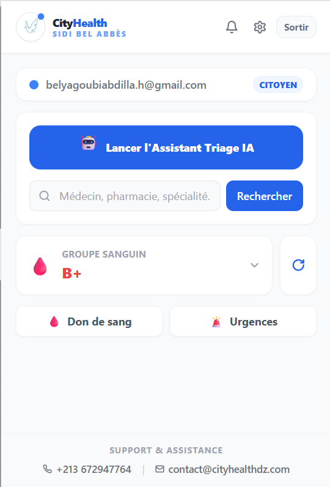
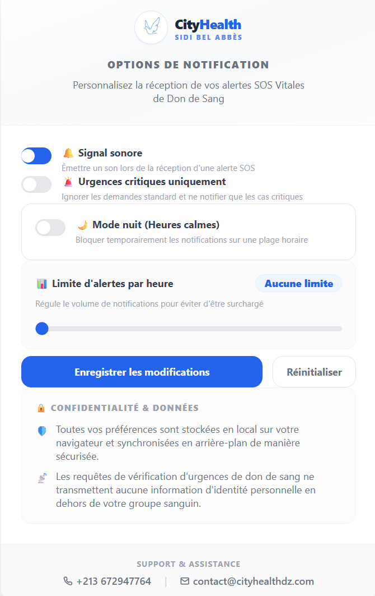

<h1 align="center">Browser Extension</h1>

<div align="center">

**Real-time blood donation alerts and one-click healthcare search — inside your browser.**


</div>

---

<h2 align="center">Overview</h2>

The CityHealth browser extension solves one specific problem: blood donation requests in Algeria are currently shared through WhatsApp groups and Facebook posts. By the time a compatible donor sees the request, hours may have passed.

The extension holds a persistent Supabase Realtime channel in a Manifest V3 service worker. When a new blood request is inserted into the database, the worker checks it against the user's registered blood type and wilaya. If there's a match, a native browser notification fires — even if the browser is minimised. The round-trip from database insert to user notification is under a second.

---

<h2 align="center">Features</h2>

- **Real-time blood alerts** — Matched by blood type and wilaya against the user's stored preferences.
- **Quick healthcare search** — Find nearby providers without leaving the current page.
- **Pharmacy on duty** — Check tonight's open pharmacies in one click.
- **Badge counter** — Extension icon updates with the number of pending alerts.
- **Privacy-first** — All preferences stored locally via the Chrome Storage API. No tracking, no analytics.

---

<h2 align="center">Architecture</h2>

```
Supabase Realtime (WebSocket)
    ↓  INSERT on blood_donation_requests
MV3 Service Worker (background.ts)
    ↓  Check: blood_type match + wilaya match
    ↓  Match → chrome.notifications.create()
Native OS notification → user
    ↓  Badge count update → chrome.action.setBadgeText()
```

The service worker lifecycle is kept alive using the Supabase Realtime client's ping mechanism. This avoids the MV3 service worker idle timeout without requiring any browser permissions beyond `notifications` and `storage`.

---

<h2 align="center">Tech Stack</h2>

| Layer | Technology |
|:---|:---|
| Framework | React 18 + TypeScript |
| Build | Vite (separate configs for popup and background) |
| Styling | Tailwind CSS |
| Manifest | V3 (Service Workers) |
| Realtime | Supabase Realtime (WebSocket) |
| Storage | Chrome Storage API |

---

<h2 align="center">Installation</h2>

### For users (Chrome)

1. Download the latest `.zip` from [Releases](https://github.com/BELYAGOUBIABDELILAH/Cityhealth/releases)
2. Open `chrome://extensions/` → enable **Developer mode**
3. Click **Load unpacked** → select the extracted folder
4. Open the extension popup → set your blood type and wilaya

### For developers (local build)

```bash
git clone https://github.com/BELYAGOUBIABDELILAH/Cityhealth.git
cd browser-extension
npm install
cp .env.example .env
# Add VITE_SUPABASE_URL and VITE_SUPABASE_ANON_KEY
npm run build
# Load browser-extension/dist as an unpacked extension
```

---

<h2 align="center">Screenshots</h2>

<div align="center">
  
  
</div>

---

<h2 align="center">Related Platforms</h2>

- [Web Platform](../web-platform)
- [Mobile Application](../mobile-application)
- [AI MCP Server](../ai-mcp-server)
- [REST API](../rest-api)

---

<div align="center">

**Built by [Abdelilah Belyagoubi](https://github.com/BELYAGOUBIABDELILAH) & [Naimi Abdeljalil](https://github.com/Abdeljalil)**  
*Part of the CityHealth Master's Thesis · 2025–2026*

</div>
