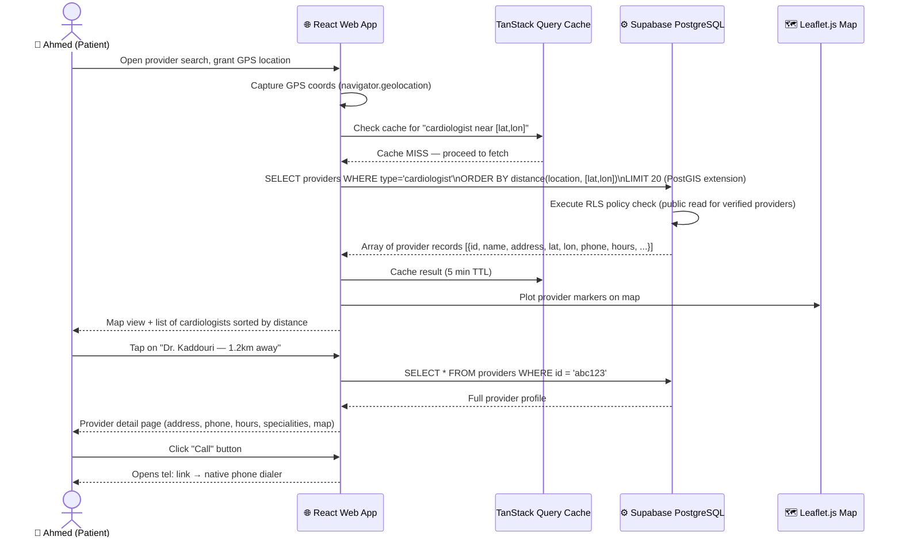
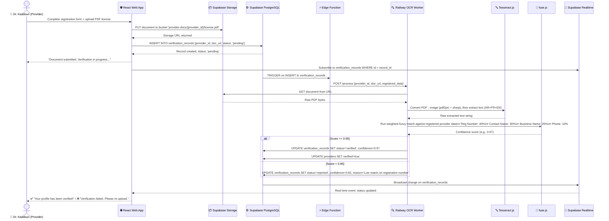
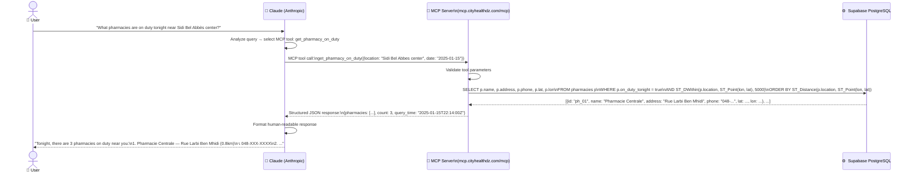

# 🔄 CityHealth — Data Flow Documentation

This document describes how data flows through the CityHealth system for three key operational scenarios.

---

## Scenario 1: A Patient Finds a Doctor

### User Story
> "Ahmed is in Sidi Bel Abbès and has chest pain. He opens CityHealth and searches for a cardiologist near him."

### Data Flow



### Key Data Tables Involved

| Table | Purpose |
|---|---|
| `providers` | Main provider records (name, type, location, hours, contact) |
| `provider_specialities` | M2M relationship between providers and speciality tags |
| `verification_records` | Join to only show `verified` providers |

### Performance Notes
- TanStack Query caches results for 5 minutes to avoid redundant DB calls
- PostGIS `ST_DWithin` function enables efficient radius queries on indexed geometry columns
- Only `verified = true` providers are returned (enforced at RLS level, not just in query)

---

## Scenario 2: A Provider Gets Verified via OCR

### User Story
> "Dr. Kaddouri registers on CityHealth and uploads her medical license PDF to be verified."

### Data Flow



### Key Data Tables Involved

| Table | Purpose |
|---|---|
| `providers` | Provider base record, `verified` boolean flag |
| `verification_records` | Per-document OCR job record with status + confidence score |
| `supabase_storage` | File storage for uploaded documents (signed URL access) |

### OCR Confidence Scoring Detail

| Field | Weight | Extraction Method |
|---|---|---|
| Legal Registration Number | 40% | Regex + Tesseract from document |
| Contact Person Name | 30% | NER-style extraction + fuse.js |
| Business/Clinic Name | 20% | Full-text match + fuse.js |
| Contact Phone | 10% | Regex extraction |

If any individual field has 0 confidence, the overall score is penalized significantly. A minimum of 95% overall confidence is required for automatic verification.

---

## Scenario 3: An AI Assistant Queries Health Data via MCP

### User Story
> "A user asks Claude: 'What pharmacies are on duty tonight near Sidi Bel Abbès city center?'"

### Data Flow



### MCP Tool Specification: `get_pharmacy_on_duty`

**Input parameters:**
```json
{
  "location": "string (city name or coordinates)",
  "date": "ISO 8601 date string (optional, defaults to today)",
  "radius_km": "number (optional, defaults to 5)"
}
```

**Output:**
```json
{
  "pharmacies": [
    {
      "id": "ph_01",
      "name": "Pharmacie Centrale",
      "address": "Rue Larbi Ben Mhidi, Sidi Bel Abbès",
      "phone": "048-123-4567",
      "lat": 35.2018,
      "lon": -0.6316,
      "distance_km": 0.8,
      "on_duty_until": "2025-01-16T08:00:00Z"
    }
  ],
  "count": 3,
  "query_time": "2025-01-15T22:14:00Z",
  "coverage_area": "Sidi Bel Abbès"
}
```

### Why MCP Changes Everything

Traditional health directories require users to visit a website, navigate menus, and manually search. With MCP:

1. AI assistants can **proactively query** healthcare data during conversation
2. Results are **always real-time** — the same data the web app shows
3. AI can **combine tools** — e.g., check if a pharmacy near an emergency provider is open
4. The MCP server is **read-only** — AI assistants can never modify the database
5. Any MCP-compatible AI can integrate **without custom API work**

This positions CityHealth as a **healthcare data infrastructure layer** for the AI era, not just a consumer app.

---

*For architecture overview, see [`system-architecture.md`](system-architecture.md). For MCP server details, see [`../features/mcp-server.md`](../features/mcp-server.md).*
