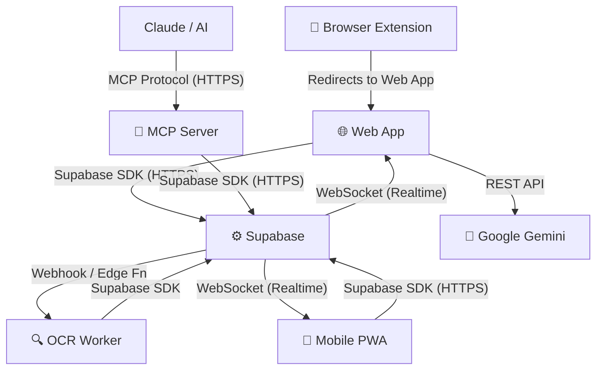

# 🏛️ CityHealth — System Architecture

## Overview

CityHealth is a **multi-surface, AI-native healthcare platform** built on a hybrid architecture that combines a battle-tested relational database (Supabase/PostgreSQL), a modern React frontend, a serverless AI layer (Google Gemini), and a real-time OCR verification pipeline — all bound together via a shared database as the **Single Source of Truth**.

---

## 🧠 Core Architectural Principles

### 1. Single Source of Truth
Every surface in the CityHealth ecosystem — web, mobile PWA, browser extension, and MCP server — reads from and writes to the **same Supabase PostgreSQL database**. There is no data duplication, no sync conflict, no divergence. What patients see on mobile is identical to what AI assistants query via MCP.

### 2. AI-Native Design
CityHealth was designed from the ground up to be queryable by AI systems. The MCP server is not an afterthought — it is a first-class architectural layer that exposes healthcare data as structured, AI-readable tools.

### 3. Trust Through Verification
Every provider on CityHealth goes through a multi-step OCR verification pipeline before being listed. This ensures data quality and builds patient trust in a domain where accuracy is critical.

### 4. Multilingual by Default
The system handles Arabic (RTL), French, and English at every layer — the UI, the OCR pipeline, database storage, and AI responses.

---

## 🔷 System Components

### Component 1: Web Frontend

**Technology**: React 18 + TypeScript, built with Vite  
**Hosting**: Cloud CDN (production-grade)  
**State Management**: TanStack Query (server) + Zustand (client)

The web frontend is a single-page application that communicates with Supabase via its JavaScript SDK. Key responsibilities:

- Rendering provider search results from PostgreSQL
- Displaying interactive GPS maps via Leaflet.js
- Authenticating users via Supabase Auth (JWT tokens)
- Uploading verification documents to Supabase Storage
- Triggering the AI health assistant via Google Gemini API
- Subscribing to real-time updates (OCR status, blood donation alerts) via Supabase Realtime WebSockets

---

### Component 2: Mobile PWA

**Technology**: Same React codebase, enhanced with Service Worker + Web App Manifest  
**Capabilities**: Offline caching, push notifications, "Add to Home Screen"

The PWA layer is not a separate codebase — it is a **progressive enhancement** of the web application. When users visit on mobile, they get:

- A `manifest.json` for native-like installation
- A Service Worker pre-caching critical assets and provider data
- Push notification support for blood donation emergencies
- Responsive design that adapts to small screens with bottom navigation

---

### Component 3: Supabase Backend

**Technology**: Supabase (PostgreSQL, Auth, Storage, Edge Functions, Realtime)

Supabase serves as the **central nervous system** of CityHealth:

| Service | Role |
|---|---|
| **PostgreSQL** | Primary data store (providers, patients, donations, pharmacies) |
| **Row Level Security** | Per-table, per-role access control enforced at the database level |
| **Auth** | JWT-based authentication, role assignment (patient, provider, admin) |
| **Storage** | Secure document buckets for provider verification files (PDFs, images) |
| **Edge Functions** | Serverless TypeScript functions for document processing triggers |
| **Realtime** | WebSocket subscriptions for live OCR status updates and alerts |

---

### Component 4: OCR Verification Worker

**Technology**: Node.js, Tesseract.js, fuse.js, pdf2pic, sharp  
**Hosting**: Railway (cron job, always-on)

The OCR worker is a standalone microservice that runs on Railway. When a provider submits verification documents:

1. Supabase Storage receives the PDF/image
2. An Edge Function triggers the Railway OCR worker
3. The worker converts PDFs to images via `pdf2pic` + `sharp`
4. `Tesseract.js` extracts text in Arabic, French, and English
5. `fuse.js` performs weighted fuzzy matching against registered provider data:
   - Legal Registration Number: **40%** weight
   - Contact Name: **30%** weight
   - Business Name: **20%** weight
   - Contact Phone: **10%** weight
6. If confidence ≥ 95%, provider status is set to `verified`
7. The result is written back to PostgreSQL
8. Supabase Realtime pushes the status update to the frontend

---

### Component 5: AI Health Assistant

**Technology**: Google Gemini 1.5 Flash  
**Integration**: Direct API call from React frontend

The AI health assistant is embedded in the web platform and operates as a conversational interface. Patients can ask health-related questions, describe symptoms, and receive general guidance. The assistant is context-aware and knows about the CityHealth provider database to help route patients to appropriate care.

---

### Component 6: MCP Server

**Technology**: Node.js, Model Context Protocol SDK  
**Hosting**: Railway (always-on, HTTPS)  
**Endpoint**: `https://mcp.cityhealthdz.com/mcp`

The MCP server is a **Model Context Protocol** compliant server that exposes CityHealth's healthcare data as structured tools to any MCP-compatible AI assistant. It queries the same Supabase PostgreSQL database as the frontend, ensuring real-time accuracy.

This component is what makes CityHealth **AI-native**: any AI assistant that supports MCP can now answer real healthcare questions about Sidi Bel Abbès without hallucinating.

---

### Component 7: Browser Extension

**Technology**: Manifest V3, Vanilla JavaScript  
**Compatibility**: Chrome, Firefox

A lightweight extension popup that provides quick access to CityHealth features from any webpage. It communicates with the main web platform and displays a badge for blood donation emergency alerts.

---

## 🔄 Inter-Component Communication

---

## 🔐 Security Architecture

| Layer | Mechanism |
|---|---|
| Authentication | Supabase JWT — issued on login, validated on every request |
| Authorization | PostgreSQL Row Level Security — per-table, per-role policies |
| Storage Access | Signed URLs — documents are never publicly accessible |
| MCP Access | HTTPS-only, read-only Supabase service role for MCP queries |
| OCR Worker | Railway private networking, service role key (not anon) |
| Admin Access | Dedicated admin role with elevated RLS policies |

---

## 📈 Scalability Considerations

- **Database**: Supabase PostgreSQL can scale vertically (upgrade compute) or horizontally (read replicas for high-traffic read-heavy patterns)
- **OCR Worker**: Stateless Railway service — can run multiple concurrent workers for parallel document processing
- **MCP Server**: Stateless Node.js server — horizontally scalable via Railway's scaling features
- **Frontend**: Fully static SPA deployed to CDN — scales to unlimited users at near-zero marginal cost
- **AI**: Gemini API is rate-limited per Google's quotas — can be cached for common health queries

---

*For data flow specifics, see [`data-flow.md`](data-flow.md). For UML diagrams, see [`../uml/`](../uml/).*
