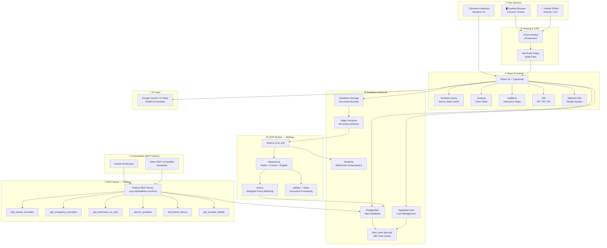

# 🏗️ CityHealth — Tech Stack Diagram

This document provides a full visual overview of the CityHealth technology ecosystem — from user devices to AI integration layers — using both ASCII art and Mermaid diagrams.

---

## 🎨 ASCII Architecture Overview

```
┌─────────────────────────────────────────────────────────────────────────────────┐
│                            🌍 USER DEVICES                                      │
│                                                                                  │
│   ┌─────────────────┐   ┌──────────────────┐   ┌─────────────────────────────┐ │
│   │  🖥️ Desktop / PC │   │  📱 Mobile (PWA)  │   │  🔌 Browser Extension        │ │
│   │  Chrome/Firefox  │   │  Android / iOS   │   │  Chrome / Firefox MV3       │ │
│   └────────┬────────┘   └────────┬─────────┘   └─────────────┬───────────────┘ │
└────────────┼────────────────────┼──────────────────────────── ┼────────────────┘
             │                    │                              │
             ▼                    ▼                              ▼
┌─────────────────────────────────────────────────────────────────────────────────┐
│                         🌐 FRONTEND LAYER                                        │
│                                                                                  │
│              ┌────────────────────────────────────────────┐                     │
│              │   React 18 + TypeScript (Vite Build)        │                    │
│              │   • TanStack Query (server state)           │                    │
│              │   • Zustand (client state)                  │                    │
│              │   • Tailwind CSS (design system)            │                    │
│              │   • Leaflet.js + OpenStreetMap (maps)       │                    │
│              │   • i18n: Arabic RTL / French / English     │                    │
│              └───────────────────┬────────────────────────┘                     │
└─────────────────────────────────┼───────────────────────────────────────────────┘
                                  │
             ┌────────────────────┼────────────────────┐
             ▼                    ▼                    ▼
┌────────────────────┐  ┌─────────────────────┐  ┌─────────────────────────────┐
│  ⚙️ SUPABASE BACKEND │  │  🧠 AI LAYER          │  │  🔍 OCR WORKER (Railway)    │
│                     │  │                      │  │                             │
│  • PostgreSQL DB    │  │  Google Gemini 1.5   │  │  Node.js Cron Service       │
│  • Row Level Sec.   │  │  Flash (Chat/AI)     │  │  • Tesseract.js (AR/FR/EN)  │
│  • Supabase Auth    │  │                      │  │  • pdf2pic + sharp          │
│  • Storage Buckets  │  │                      │  │  • fuse.js fuzzy matching   │
│  • Edge Functions   │  │                      │  │  • 95% confidence threshold │
│  • Realtime         │  │                      │  │                             │
└────────┬───────────┘  └──────────────────────┘  └──────────────┬──────────────┘
         │                                                         │
         │◄────────────────────────────────────────────────────────┘
         │
         ▼
┌─────────────────────────────────────────────────────────────────────────────────┐
│                      🤖 MCP SERVER (Railway — Always On)                         │
│                                                                                  │
│              ┌────────────────────────────────────────────┐                     │
│              │   Node.js MCP Server                        │                    │
│              │   mcp.cityhealthdz.com/mcp                  │                    │
│              │                                             │                    │
│              │   Tools exposed:                            │                    │
│              │   • find_nearby_providers                   │                    │
│              │   • get_emergency_providers                 │                    │
│              │   • get_pharmacy_on_duty                    │                    │
│              │   • search_providers                        │                    │
│              │   • find_blood_donors                       │                    │
│              │   • get_provider_details                    │                    │
│              └─────────────────────┬───────────────────────┘                   │
└────────────────────────────────────┼────────────────────────────────────────────┘
                                     │
                                     ▼
┌─────────────────────────────────────────────────────────────────────────────────┐
│                      🤖 MCP CLIENTS (AI Assistants)                              │
│                                                                                  │
│     ┌──────────────────┐   ┌──────────────────┐   ┌────────────────────────┐   │
│     │  Claude (Anthropic) │   │  Any MCP-Compatible │   │  Future AI Integrations │ │
│     │                  │   │  Assistant        │   │                        │   │
│     └──────────────────┘   └──────────────────┘   └────────────────────────┘   │
└─────────────────────────────────────────────────────────────────────────────────┘
```

---

## 🧩 Mermaid — Full Layer Diagram



---

## 📊 Technology Inventory

| Layer | Component | Technology | Hosting |
|---|---|---|---|
| User Interface | Web App | React 18, TypeScript, Vite | Cloud CDN |
| User Interface | Mobile | PWA, Service Worker | Self-hosted |
| User Interface | Extension | Manifest V3, Vanilla JS | Chrome/Firefox Store |
| Frontend State | Server Cache | TanStack Query | Client |
| Frontend State | UI State | Zustand | Client |
| Maps | Interactive Maps | Leaflet.js + OpenStreetMap | Client |
| Internationalization | i18n | Custom i18n setup | Client |
| Styling | Design System | Tailwind CSS | Client |
| Database | Main DB | Supabase PostgreSQL | Supabase Cloud |
| Security | Auth + RLS | Supabase Auth, JWT | Supabase Cloud |
| Storage | Documents | Supabase Storage | Supabase Cloud |
| Real-time | WebSockets | Supabase Realtime | Supabase Cloud |
| AI Chat | Health Assistant | Google Gemini 1.5 Flash | Google Cloud |
| OCR | Document Processing | Tesseract.js (AR/FR/EN) | Railway |
| PDF | PDF to Image | pdf2pic + sharp | Railway |
| Matching | Fuzzy Verification | fuse.js | Railway |
| MCP | AI Data API | Node.js MCP Server | Railway |
| CI/CD | Automation | GitHub Actions | GitHub |

---

*Last updated: 2025 — CityHealth v1.0*
