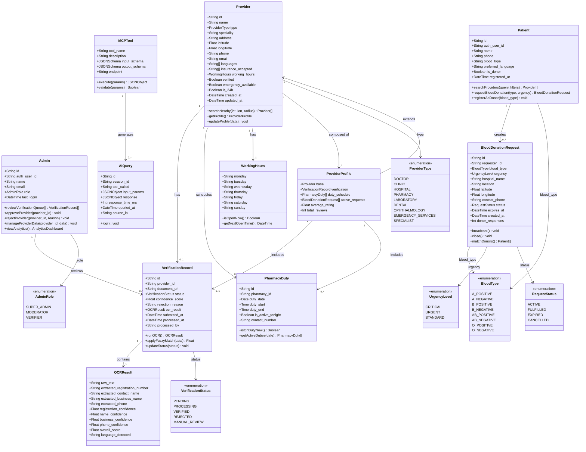

# 🧩 CityHealth — Class Diagram

## Overview

This document presents the Mermaid UML class diagram for the CityHealth domain model, covering all primary entities, their attributes, methods, and relationships.

---

## Class Diagram

---

## Entity Descriptions

### `Provider`
Core entity representing any healthcare provider on the platform. Includes doctors, clinics, hospitals, pharmacies, labs, and specialists. The `verified` boolean is set to `true` only after successful OCR document verification.

### `Patient`
Registered user who consumes healthcare services. Patients can also be blood donors — tracked via `is_donor` and `blood_type` fields.

### `Admin`
Platform administrator with elevated privileges. Admins can manually override OCR verification results and manage all platform data.

### `BloodDonationRequest`
An urgent request posted by a patient (or on behalf of one) for a specific blood type. Requests expire after a configured duration and trigger push notifications to registered donors of the matching blood type.

### `PharmacyDuty`
Represents a single on-duty assignment for a pharmacy. The `isOnDutyNow()` method checks if the current datetime falls within the duty window, powering the "pharmacy on duty tonight" feature.

### `VerificationRecord`
Tracks the full lifecycle of a provider's document verification process — from submission through OCR processing to final status. Contains the full `OCRResult` as a JSON field.

### `OCRResult`
The structured output of Tesseract.js text extraction and fuse.js matching. Each field has an individual confidence score, and the `overall_score` is the weighted average used to make the verification decision.

### `MCPTool`
Represents one of the 6 tools exposed by the CityHealth MCP Server. Each tool has a defined input/output JSON schema and logs every invocation as an `AIQuery`.

### `AIQuery`
Audit log entry for every MCP tool call. Used for usage analytics, debugging, and rate limiting.

---

*See [`er-diagram.md`](er-diagram.md) for the database-level entity relationships.*
