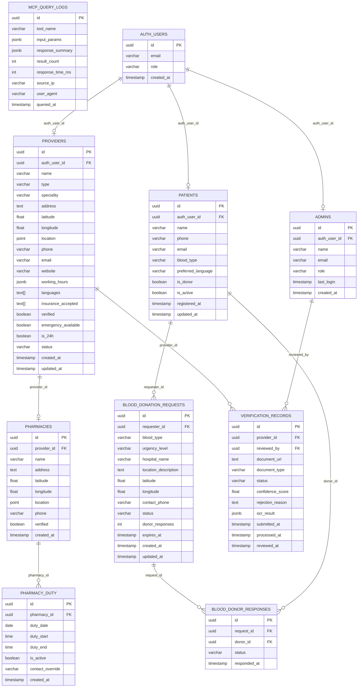

# 🗃️ CityHealth — Entity-Relationship Diagram

## Overview

This document presents the complete Supabase PostgreSQL schema for CityHealth as a Mermaid `erDiagram`, showing all tables, columns, foreign key relationships, and cardinality.

---

## Entity-Relationship Diagram

---

## Table Descriptions

### `providers`
The central table for all healthcare providers. The `location` column is a PostGIS `POINT` type enabling efficient geospatial queries (`ST_DWithin`, `ST_Distance`). Only rows with `verified = true` are returned to public users (enforced via RLS).

**Key constraints:**
- `auth_user_id` → `auth.users.id` (FK, CASCADE on delete)
- `type` → enum: `doctor | clinic | hospital | pharmacy | laboratory | dental | ophthalmology | emergency_services | specialist`
- `status` → enum: `active | suspended | pending`

---

### `patients`
Registered patients. Also used as blood donor profiles when `is_donor = true`. The `blood_type` field is stored as a varchar matching standard ABO+Rh notation (e.g., `A+`, `O-`).

---

### `admins`
Platform administrators. Created manually by super-admins. The `role` field supports `super_admin | moderator | verifier`.

---

### `blood_donation_requests`
Emergency blood requests posted by patients or medical staff. Requests automatically expire based on `expires_at`. The `status` field tracks lifecycle: `active → fulfilled | expired | cancelled`.

**Blood types supported:** A+, A−, B+, B−, AB+, AB−, O+, O−

**Urgency levels:** `critical | urgent | standard`

---

### `blood_donor_responses`
Junction table tracking which donors have responded to which blood requests. Enables the system to prevent duplicate responses and track fulfillment.

---

### `pharmacies`
Pharmacy-specific extension of the providers table. Contains a denormalized copy of location data for faster pharmacy-only queries. Linked to `providers` via `provider_id`.

---

### `pharmacy_duty`
Tracks on-duty schedules for pharmacies. Multiple entries per pharmacy for different dates. The `is_active` boolean is computed nightly by a cron job based on `duty_date`, `duty_start`, and `duty_end`.

**Key query:** `SELECT * FROM pharmacies JOIN pharmacy_duty ON id = pharmacy_id WHERE duty_date = CURRENT_DATE AND is_active = true`

---

### `verification_records`
Full audit trail for provider document verification. The `ocr_result` JSONB column stores the complete Tesseract.js output and fuse.js confidence breakdown for every field.

**Status lifecycle:** `pending → processing → verified | rejected | manual_review`

---

### `mcp_query_logs`
Audit log for all MCP tool calls. Enables:
- Usage analytics (which tools are called most)
- Rate limiting (by `source_ip`)
- Performance monitoring (`response_time_ms`)
- Debugging AI query failures

---

## Row Level Security (RLS) Summary

| Table | Public Read | Auth Read | Provider Write | Admin Write |
|---|---|---|---|---|
| `providers` | verified only | own record | own record | all |
| `patients` | ❌ | own record | ❌ | all |
| `admins` | ❌ | ❌ | ❌ | own record |
| `blood_donation_requests` | active only | own + active | ❌ | all |
| `pharmacies` | verified only | ❌ | own record | all |
| `pharmacy_duty` | active today | own pharmacy | own pharmacy | all |
| `verification_records` | ❌ | own record | own record | all |
| `mcp_query_logs` | ❌ | ❌ | ❌ | read only |

---

*For full data flow, see [`../architecture/data-flow.md`](../architecture/data-flow.md). For class-level model, see [`class-diagram.md`](class-diagram.md).*
