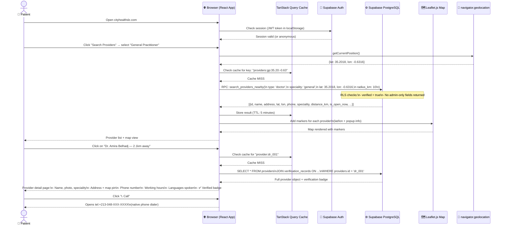
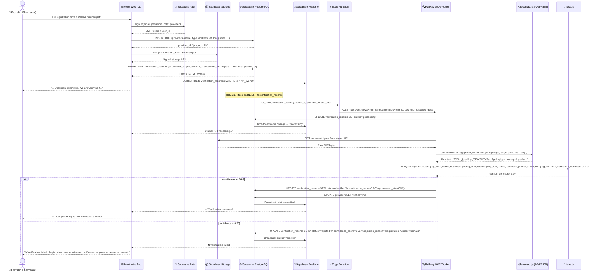

# 🔀 CityHealth — Sequence Diagrams

This document contains three complete UML sequence diagrams for the CityHealth platform's most critical user flows.

---

## Diagram 1: Patient Searches for a Provider

### Scenario
> A patient opens the CityHealth web app, grants GPS access, and searches for a nearby general practitioner. They view the full profile and find the doctor's phone number.

---

## Diagram 2: Provider Submits Documents → OCR Verification Pipeline

### Scenario
> A new pharmacy registers on CityHealth and uploads its official registration certificate PDF. The OCR worker processes it and updates the provider's verification status in real time.

---

## Diagram 3: AI Assistant Calls MCP → Supabase → Structured Response

### Scenario
> A user asks Claude (with CityHealth MCP configured): *"Is there a cardiologist available for emergency near Sidi Bel Abbès right now?"*

```mermaid
sequenceDiagram
    actor User as 👤 User
    participant Claude as 🤖 Claude (Anthropic)
    participant MCPClient as MCP Client Layer
    participant MCPServer as 🔗 CityHealth MCP Server\n(mcp.cityhealthdz.com/mcp)
    participant SupaDB as ⚙️ Supabase PostgreSQL
    participant MCPLogger as 📊 AIQuery Logger

    User->>Claude: "Is there a cardiologist available for emergency near Sidi Bel Abbès right now?"

    Claude->>Claude: Analyze intent:\n- Need: emergency cardiologist\n- Location: Sidi Bel Abbès\n- Constraint: available now

    Claude->>MCPClient: Select tool: get_emergency_providers\nwith params: {speciality: "cardiologist", location: "Sidi Bel Abbes"}

    MCPClient->>MCPServer: MCP protocol request:\n{\n  "tool": "get_emergency_providers",\n  "params": {\n    "speciality": "cardiologist",\n    "location": "Sidi Bel Abbes",\n    "available_now": true\n  }\n}

    MCPServer->>MCPServer: Validate input against JSON schema\nGeocode "Sidi Bel Abbes" → {lat: 35.2018, lon: -0.6316}

    MCPServer->>SupaDB: SELECT p.id, p.name, p.address, p.phone,\n  p.lat, p.lon, p.is_24h, p.emergency_available,\n  ST_Distance(p.location, point) as dist_km\nFROM providers p\nWHERE p.verified = true\n  AND p.type = 'doctor'\n  AND p.speciality ILIKE '%cardiolog%'\n  AND (p.is_24h = true OR p.emergency_available = true)\n  AND ST_DWithin(p.location, ST_Point(-0.6316, 35.2018), 20000)\nORDER BY dist_km\nLIMIT 5

    Note over SupaDB: RLS: read-only service role\nNo patient data accessible

    SupaDB-->>MCPServer: [\n  {\n    id: "prv_001",\n    name: "Dr. Youcef Belkacem",\n    speciality: "Cardiologist",\n    address: "12 Rue de la Paix, Sidi Bel Abbès",\n    phone: "048-123-4567",\n    is_24h: true,\n    emergency_available: true,\n    dist_km: 1.4\n  }\n]

    MCPServer->>MCPLogger: INSERT INTO ai_query_logs {\n  tool: "get_emergency_providers",\n  params: {...},\n  result_count: 1,\n  response_time_ms: 142\n}

    MCPServer-->>MCPClient: {\n  "providers": [\n    {\n      "id": "prv_001",\n      "name": "Dr. Youcef Belkacem",\n      "speciality": "Cardiologist",\n      "address": "12 Rue de la Paix, Sidi Bel Abbès",\n      "phone": "048-123-4567",\n      "available_24h": true,\n      "emergency": true,\n      "distance_km": 1.4\n    }\n  ],\n  "count": 1,\n  "coverage": "20km radius around Sidi Bel Abbès"\n}

    MCPClient-->>Claude: Structured JSON response

    Claude->>Claude: Format natural language response\nwith all provider details

    Claude-->>User: "Yes! I found a cardiologist available for emergency near you:\n\n🏥 **Dr. Youcef Belkacem** — Cardiologist\n📍 12 Rue de la Paix, Sidi Bel Abbès (1.4km away)\n📞 048-123-4567\n🚨 24/7 Emergency: ✅\n\nI recommend calling ahead to confirm availability. Would you like me to also find the nearest emergency room?"
```

---

## Summary

| Diagram | Key System Interaction | Critical Path |
|---|---|---|
| **1. Patient Search** | React → Supabase PostgreSQL → Leaflet Map | Cache miss → DB query → Map render |
| **2. OCR Verification** | Storage → Edge Function → Railway Worker → Realtime | PDF upload → Tesseract → fuse.js → DB update → WebSocket push |
| **3. MCP AI Query** | AI → MCP Server → Supabase → Structured JSON | Tool call → PostGIS query → Formatted response |

---

*For the full system architecture, see [`../architecture/system-architecture.md`](../architecture/system-architecture.md).*
