# 📐 CityHealth — UML Use Case Diagram

## Overview

This document presents the complete UML use case diagram for the CityHealth platform, covering all five system actors and their associated use cases.

---

## Actors

| Actor | Role |
|---|---|
| 👤 **Patient** | General public user seeking healthcare information |
| 🏥 **Provider** | Registered healthcare professional or facility |
| 🛡️ **Admin** | Platform administrator managing data and verifications |
| 🤖 **AI Assistant** | MCP-compatible AI (e.g., Claude) querying health data |
| ⚙️ **System (Cron)** | Automated background jobs (OCR worker, notifications) |

---

## Full Use Case Diagram

```mermaid
graph TB
    %% Actors
    Patient((👤 Patient))
    Provider((🏥 Provider))
    Admin((🛡️ Admin))
    AIAssistant((🤖 AI Assistant))
    System((⚙️ System / Cron))

    %% Patient Use Cases
    subgraph PatientUC["Patient Use Cases"]
        UC1["Search Healthcare Providers"]
        UC2["View Provider Profile"]
        UC3["Find Pharmacy On Duty"]
        UC4["Access Emergency Directory"]
        UC5["Request Blood Donation"]
        UC6["Register as Blood Donor"]
        UC7["Interact with AI Health Assistant"]
        UC8["Install Mobile PWA"]
        UC9["Receive Push Notifications"]
        UC10["Use Browser Extension"]
    end

    %% Provider Use Cases
    subgraph ProviderUC["Provider Use Cases"]
        UC11["Register Provider Profile"]
        UC12["Submit Verification Documents"]
        UC13["Update Profile Information"]
        UC14["View Verification Status"]
        UC15["Manage Pharmacy Duty Schedule"]
    end

    %% Admin Use Cases
    subgraph AdminUC["Admin Use Cases"]
        UC16["Review Verification Queue"]
        UC17["Approve / Reject Providers"]
        UC18["Manage All Provider Data"]
        UC19["View Platform Analytics"]
        UC20["Manage Blood Donation Alerts"]
        UC21["Configure Pharmacy Duty Roster"]
    end

    %% AI Assistant Use Cases
    subgraph AIUC["AI Assistant Use Cases (via MCP)"]
        UC22["Call find_nearby_providers"]
        UC23["Call get_emergency_providers"]
        UC24["Call get_pharmacy_on_duty"]
        UC25["Call search_providers"]
        UC26["Call find_blood_donors"]
        UC27["Call get_provider_details"]
    end

    %% System Use Cases
    subgraph SystemUC["System / Cron Use Cases"]
        UC28["Run OCR Verification Pipeline"]
        UC29["Update Pharmacy On-Duty Status"]
        UC30["Send Blood Donation Alerts"]
        UC31["Cache Provider Data for Offline"]
    end

    %% Patient connections
    Patient --> UC1
    Patient --> UC2
    Patient --> UC3
    Patient --> UC4
    Patient --> UC5
    Patient --> UC6
    Patient --> UC7
    Patient --> UC8
    Patient --> UC9
    Patient --> UC10

    %% Provider connections
    Provider --> UC11
    Provider --> UC12
    Provider --> UC13
    Provider --> UC14
    Provider --> UC15

    %% Admin connections
    Admin --> UC16
    Admin --> UC17
    Admin --> UC18
    Admin --> UC19
    Admin --> UC20
    Admin --> UC21

    %% AI connections
    AIAssistant --> UC22
    AIAssistant --> UC23
    AIAssistant --> UC24
    AIAssistant --> UC25
    AIAssistant --> UC26
    AIAssistant --> UC27

    %% System connections
    System --> UC28
    System --> UC29
    System --> UC30
    System --> UC31

    %% Cross-actor relationships (includes/extends)
    UC1 --> UC2
    UC12 --> UC28
    UC28 --> UC14
    UC5 --> UC30
    UC22 --> UC1
    UC24 --> UC3
    UC26 --> UC5
```

---

## Use Case Descriptions

### Patient Use Cases

| ID | Use Case | Description | Precondition |
|---|---|---|---|
| UC1 | Search Healthcare Providers | GPS-based or keyword search for providers by type, speciality, and distance | User grants location permission |
| UC2 | View Provider Profile | Full profile: contact, hours, speciality, map location, verification badge | Provider exists and is verified |
| UC3 | Find Pharmacy On Duty | Shows which pharmacies are on night duty (garde) for tonight | None |
| UC4 | Access Emergency Directory | Lists 24/7 and urgent care providers sorted by distance | None |
| UC5 | Request Blood Donation | Post an urgent blood request with blood type and location | User registered |
| UC6 | Register as Blood Donor | Add self to donor registry with blood type and contact | User registered |
| UC7 | AI Health Assistant | Conversational AI for general health questions and provider routing | None |
| UC8 | Install Mobile PWA | Install CityHealth to home screen on Android/iOS | Mobile device + modern browser |
| UC9 | Push Notifications | Receive emergency blood alerts and urgent care updates | PWA installed, notifications granted |
| UC10 | Browser Extension | Quick access to CityHealth from any webpage | Extension installed |

### Provider Use Cases

| ID | Use Case | Description | Precondition |
|---|---|---|---|
| UC11 | Register Profile | Create a provider account with facility details | None |
| UC12 | Submit Verification Docs | Upload medical license or registration certificate (PDF/image) | Provider account created |
| UC13 | Update Profile | Edit hours, contact info, specialities | Provider authenticated |
| UC14 | View Verification Status | Check OCR verification progress and result | Documents submitted |
| UC15 | Manage Duty Schedule | Set pharmacy on-duty dates and times | Provider is pharmacy type |

### Admin Use Cases

| ID | Use Case | Description | Precondition |
|---|---|---|---|
| UC16 | Review Verification Queue | See all pending OCR verification jobs | Admin role |
| UC17 | Approve / Reject | Manually override OCR results if needed | Admin role |
| UC18 | Manage All Data | CRUD operations on any provider record | Admin role |
| UC19 | Analytics | View registration trends, verification rates, search patterns | Admin role |
| UC20 | Blood Alerts | Manage and moderate blood donation emergency posts | Admin role |
| UC21 | Pharmacy Roster | Set or edit pharmacy on-duty schedules system-wide | Admin role |

---

*Full sequence diagrams in [`sequence-diagram.md`](sequence-diagram.md). Class diagram in [`class-diagram.md`](class-diagram.md).*
