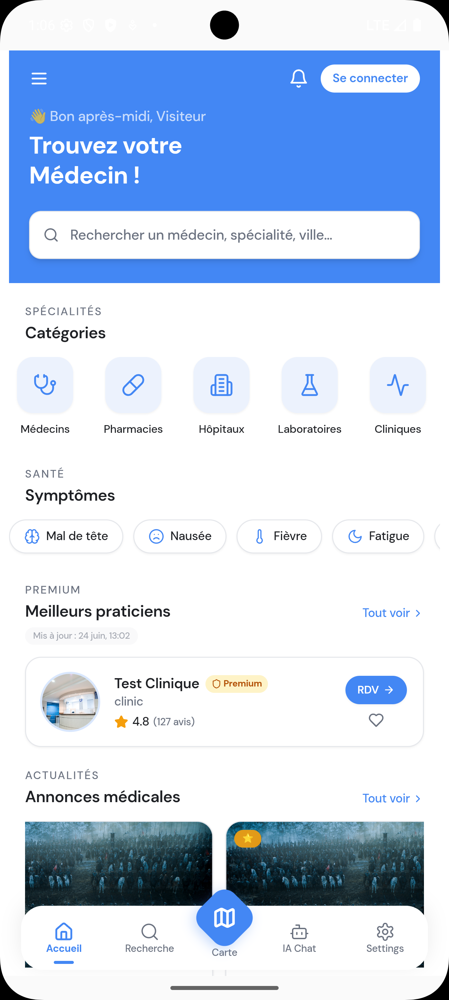
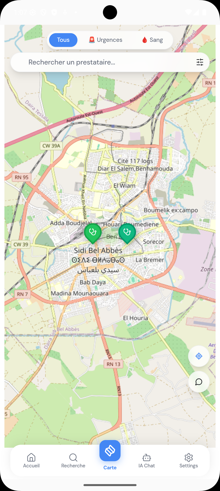
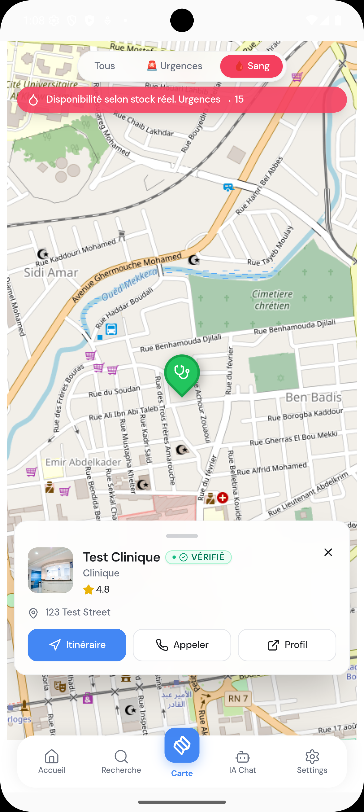
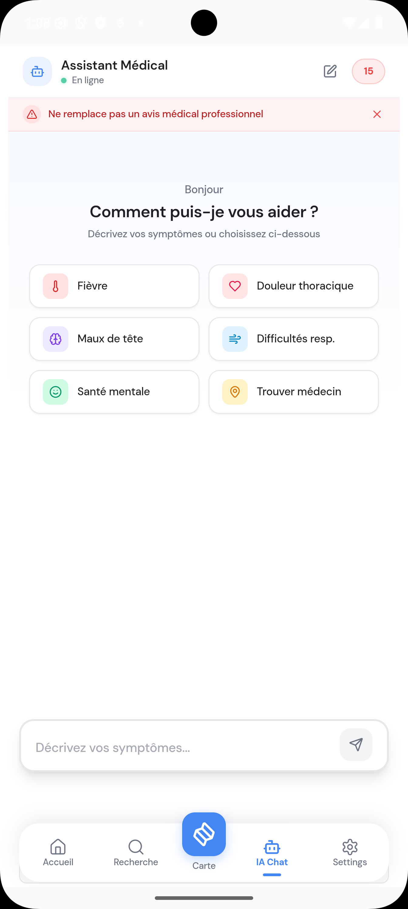
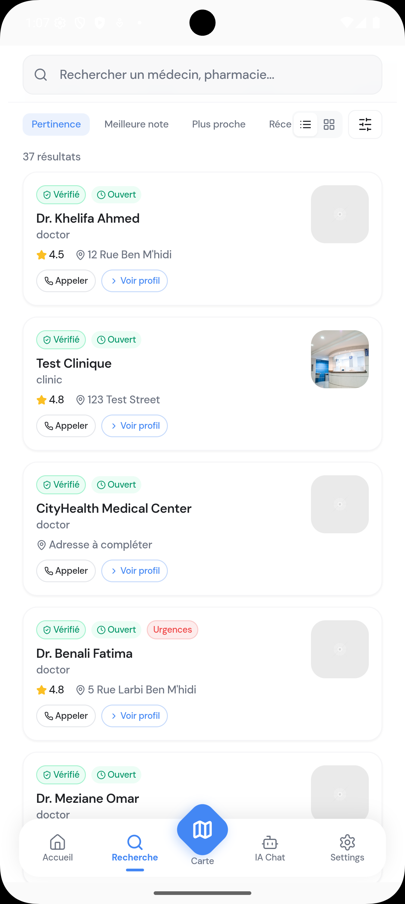
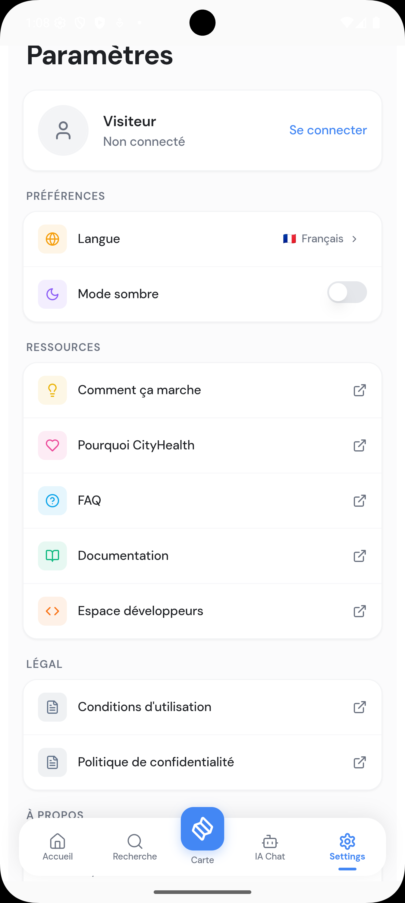

<h1 align="center">Mobile Application</h1>

<div align="center">

**On-the-go healthcare access with offline maps and emergency routing.**


[cityhealthdz.com](https://cityhealthdz.com) — available as PWA

</div>

---

<h2 align="center">Overview</h2>

The CityHealth mobile application is built with React Native (Expo) and shares the same Supabase backend as the web platform. Its core purpose is to serve users in situations where the web platform falls short: low connectivity, outdoor emergencies, and rural areas with no reliable internet. The app caches map tiles and provider profiles locally so critical lookups remain functional offline.

---

<h2 align="center">Features</h2>

**Emergency routing**
The app detects emergency intent from search input (keywords like "urgent", "accident", "emergency") and switches into a dedicated mode: it calculates the fastest route to the nearest 24/7 facility using the user's real-time GPS position and falls back to wilaya-based search if GPS is unavailable.

**Offline-first maps**
Map tiles for the last searched 50 km radius are cached locally. Provider profiles are stored in SQLite. Background sync runs when network connectivity resumes.

**AI triage chatbot**
Powered by Google Gemini 2.5 Flash. The user describes symptoms in Arabic, French, or English. The model returns a triage recommendation (self-care, pharmacy, GP, or emergency) and suggests matched providers from the local database.

**Blood donation push alerts**
Registered donors receive push notifications for requests matching their blood type and wilaya — equivalent to the browser extension, but using React Native's push notification layer.

**Dark mode**
OLED-optimised dark theme. Battery-efficient for devices with AMOLED screens — relevant in a mobile-first market.

---

<h2 align="center">Tech Stack</h2>

| Layer | Technology |
|:---|:---|
| Framework | React Native (Expo) |
| Language | TypeScript |
| Maps | React Native MapView + Leaflet.js (WebView) |
| Location | React Native Geolocation Service |
| Offline storage | AsyncStorage + SQLite |
| Backend | Supabase (Realtime + Auth + PostGIS) |
| AI | Google Gemini 2.5 Flash |
| Navigation | React Navigation 6 |

---

<h2 align="center">Architecture</h2>

```
React Native UI
    ↓  React Navigation
Native GPS (CoreLocation / Android Location)
    ↓  Coordinates
Supabase PostGIS API (ST_DWithin)
    ↓  Results
Local SQLite cache ← Background sync → Supabase
```

---

<h2 align="center">Screenshots</h2>

<div align="center">
  
  
  
  <br/><br/>
  
  
  
</div>

---

<h2 align="center">Related Platforms</h2>

- [Web Platform](../web-platform)
- [Browser Extension](../browser-extension)
- [AI MCP Server](../ai-mcp-server)
- [REST API](../rest-api)

---

<div align="center">

**Built by [Abdelilah Belyagoubi](https://github.com/BELYAGOUBIABDELILAH) & [Naimi Abdeljalil](https://github.com/Abdeljalil)**  
*Part of the CityHealth Master's Thesis · 2025–2026*

</div>
