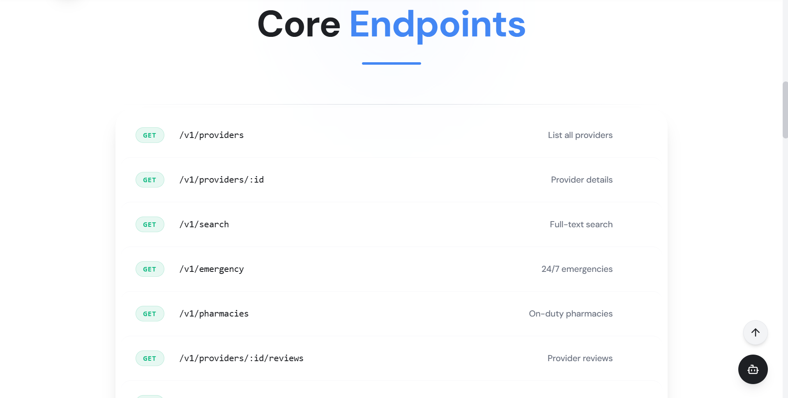

<h1 align="center">REST API</h1>

<div align="center">

**Structured access to Algeria's verified healthcare data for developers and institutions.**


[cityhealthdz.com/api/docs](https://cityhealthdz.com/api/docs)

</div>

---

<h2 align="center">Overview</h2>

The CityHealth REST API gives developers and institutions programmatic access to the same verified provider database that powers the web and mobile platforms. It is designed for three primary use cases: mobile app backends that need health directory data, hospital or insurance systems that want to validate provider credentials, and research or analytics pipelines that require structured health infrastructure data for Algeria.

---

<h2 align="center">Architecture</h2>

The API uses a **database-first** design. PostgREST compiles the PostgreSQL schema directly into REST endpoints, which means the API surface stays automatically in sync with the data model. Custom business logic runs in Supabase Edge Functions (Deno) acting as an authentication and rate-limiting gateway in front of PostgREST.

```
Client request (x-api-key header)
    ↓
Edge Function (Deno) — auth gateway
    ↓  SHA-256 key verification
    ↓  Rate limit check (token bucket)
PostgREST — SQL query translation
    ↓
PostgreSQL + PostGIS (RLS enforced)
    ↓
JSON response
```

---

<h2 align="center">Authentication</h2>

All requests require an API key in the `x-api-key` header.

```bash
curl "https://cityhealthdz.com/api/v1/providers" \
  -H "x-api-key: your_api_key"
```

Get a free API key at [cityhealthdz.com/developers](https://cityhealthdz.com/developers).

---

<h2 align="center">Endpoints</h2>

### Search providers
```http
GET /api/v1/providers?specialty=eq.Cardiology&wilaya=eq.Oran
```

### Get provider details
```http
GET /api/v1/providers/:id
```

### Nearby facilities (PostGIS)
```http
POST /api/v1/providers/nearby
Content-Type: application/json

{
  "latitude": 35.6976,
  "longitude": -0.6337,
  "radius_km": 5
}
```

### On-duty pharmacies
```http
GET /api/v1/pharmacies/duty?wilaya=eq.Algiers
```

### Blood donors
```http
GET /api/v1/blood-donors?blood_type=eq.O%2B&wilaya=eq.Constantine
```

Full interactive documentation: [cityhealthdz.com/api/docs](https://cityhealthdz.com/api/docs)

---

<h2 align="center">Rate Limits</h2>

| Tier | Requests / day | Requests / min | Price |
|:---|:---|:---|:---|
| Free | 100 | 10 | Free |
| Pro | 10,000 | 100 | $29 / month |
| Enterprise | Unlimited | 1,000 | Contact |

---

<h2 align="center">Tech Stack</h2>

| Layer | Technology |
|:---|:---|
| API generation | PostgREST (schema-first, zero hand-written CRUD) |
| Custom logic | Supabase Edge Functions (Deno) |
| Database | PostgreSQL + PostGIS |
| Auth | SHA-256 key hashing + custom middleware |
| Rate limiting | Token bucket algorithm |
| Documentation | OpenAPI 3.0 + Swagger UI |

---

<h2 align="center">Screenshots</h2>

<div align="center">
  
</div>

---

<h2 align="center">Related Platforms</h2>

- [Web Platform](../web-platform)
- [Mobile Application](../mobile-application)
- [Browser Extension](../browser-extension)
- [AI MCP Server](../ai-mcp-server)

---

<div align="center">

**Built by [Abdelilah Belyagoubi](https://github.com/BELYAGOUBIABDELILAH) & [Naimi Abdeljalil](https://github.com/Abdeljalil)**  
*Part of the CityHealth Master's Thesis · 2025–2026*

</div>
