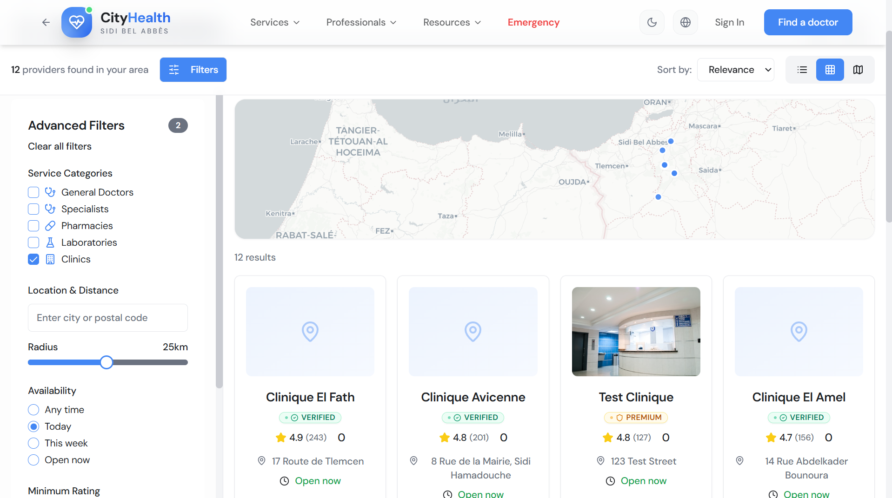
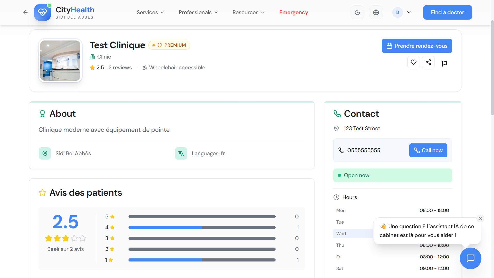

<h1 align="center">Web Platform</h1>

<div align="center">

**GPS-aware search for Algeria's verified healthcare providers.**


[cityhealthdz.com](https://cityhealthdz.com)

</div>

---

<h2 align="center">Overview</h2>

The CityHealth web platform is the primary patient-facing interface. It provides GPS-aware search across verified doctors, clinics, and pharmacies in Algeria, with a self-service provider onboarding flow that routes every new listing through an automated OCR verification pipeline before it becomes publicly visible.

---

<h2 align="center">Features</h2>

- **Interactive map search** — Leaflet.js on OpenStreetMap tiles. Providers appear as markers ranked by proximity using PostGIS `ST_DWithin`. No Google Maps dependency, no API cost.
- **Advanced filtering** — Specialty, provider type, wilaya, language spoken, insurance accepted, and on-duty availability — all applied server-side via PostgREST query parameters.
- **OCR-based provider verification** — Medical license uploaded by the provider, extracted with Tesseract.js (Arabic + French), fuzzy-matched against official registries with Fuse.js. High-confidence matches auto-approve; borderline cases go to the admin queue.
- **Pharmacy on duty** — Providers toggle their active duty status through their dashboard. The record carries a TTL expiration that resets at 08:00, so the data is always current.
- **Blood donation hub** — Post urgent requests with urgency levels (critical: 24 h, urgent: 48 h, standard: 72 h). Donors registered for a matching blood type and wilaya see requests in their feed.
- **Digital Emergency Card** — Patients can generate a personal emergency card with critical medical info and a QR code, printable and scannable by first responders.
- **Multilingual (AR / FR / EN)** — Full RTL layout for Arabic with `Tajawal` font. Language switch persists across sessions.
- **Provider dashboard** — Manage profile, hours, specialties, on-duty status, and verification documents from one place.
- **Admin dashboard** — Bulk provider review, verification audit trail, blood donation management.

---

<h2 align="center">Tech Stack</h2>

| Layer | Technology |
|:---|:---|
| Framework | React 18 + TypeScript |
| Build | Vite (Fast HMR, optimised bundles) |
| Styling | Tailwind CSS |
| State | Zustand (client) + TanStack Query (server) |
| Maps | Leaflet.js + OpenStreetMap |
| Database | Supabase — PostgreSQL + PostGIS + Realtime |
| Auth | Supabase Auth (JWT + RLS) |
| OCR | Tesseract.js (client-side, privacy-first) |
| Fuzzy match | Fuse.js (weighted scoring) |

---

<h2 align="center">Architecture</h2>

```
React SPA
    ↓  Zustand + TanStack Query
Leaflet map · Provider cards · Dashboards
    ↓  PostgREST queries
Supabase API Gateway
    ↓  Row-Level Security
PostgreSQL + PostGIS
```

All database access is mediated by RLS policies — a provider can only write to their own records; a patient has read-only access to verified public data. There is no way to bypass these policies from the client.

---

<h2 align="center">Screenshots</h2>

<div align="center">
  
  <br/><br/>
  
  
  <br/><br/>
  
  
  <br/><br/>
  
  
</div>

---

<h2 align="center">Related Platforms</h2>

- [Mobile Application](../mobile-application)
- [Browser Extension](../browser-extension)
- [AI MCP Server](../ai-mcp-server)
- [REST API](../rest-api)

---

<div align="center">

**Built by [Abdelilah Belyagoubi](https://github.com/BELYAGOUBIABDELILAH) & [Naimi Abdeljalil](https://github.com/Abdeljalil)**  
*Part of the CityHealth Master's Thesis · 2025–2026*

</div>
